# SongJournal - Public Readme

# Overview

SongJournal is a tool for organizing song recordings and writing lyrics as well as a music player for continuous playback of recordings.

The Starred version of a Song is displayed on the Home Screen. Pressing on a Song will open the Song Folder, containing all takes of a song. Takes can be appended with notes, starred, or renamed. Songs include a Lyrics Page for adding lyrics, chords, time signature, and bpm. Groups of Pages can be exported as a print-ready pdf. User can create a Setlist of songs for continuous playback in the music player.

## Access, share, and delete songs on Home Screen and change Theme on Settings Screen

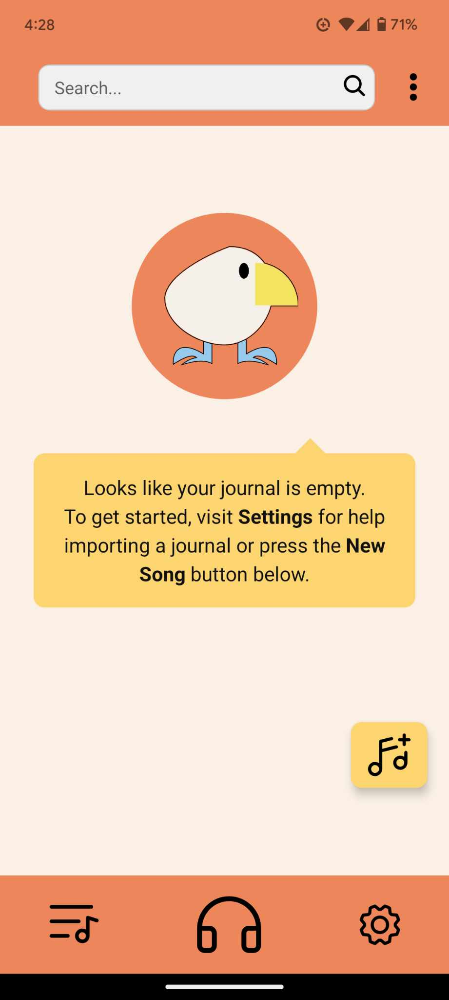
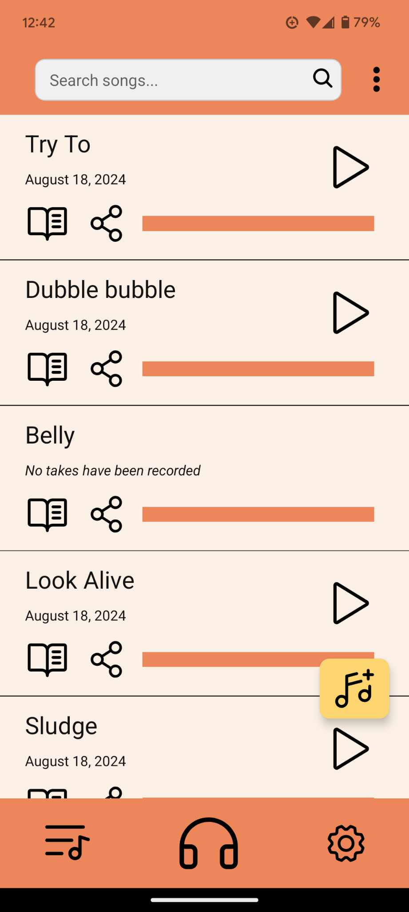
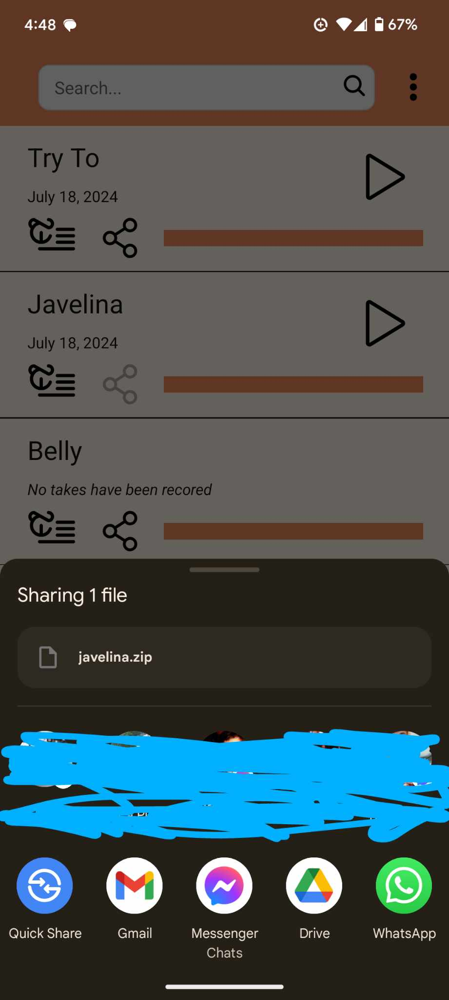

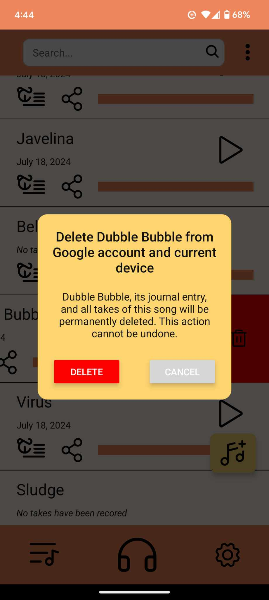

## Sort songs and create new ones

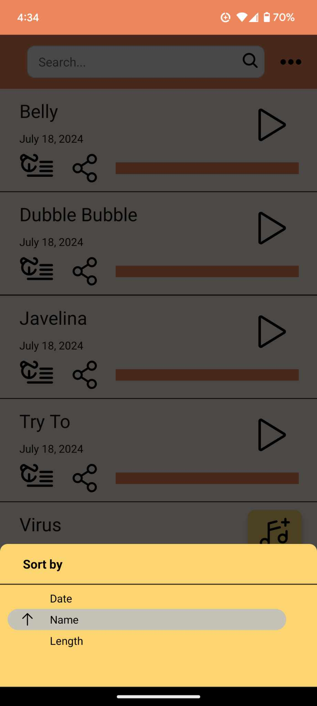
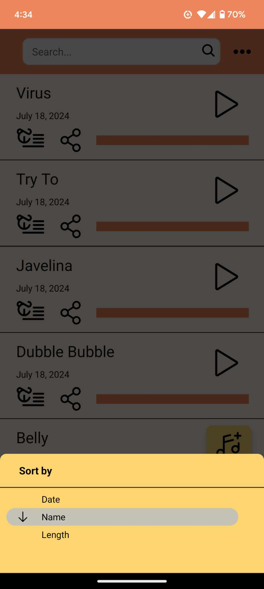
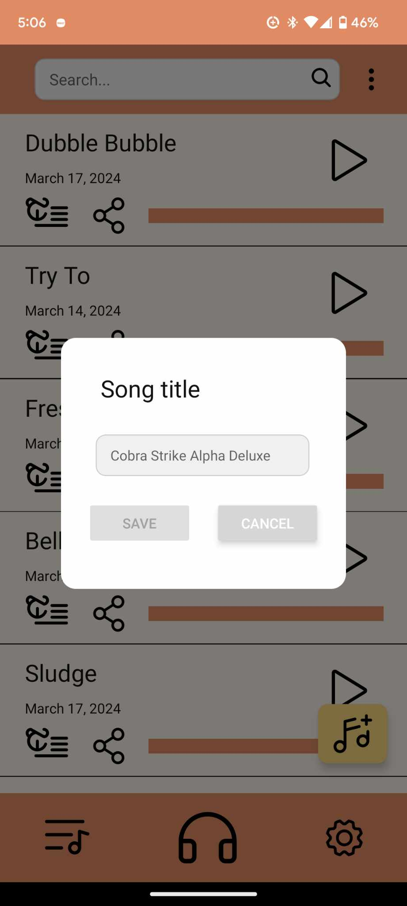

## Change Theme on Settings Screen

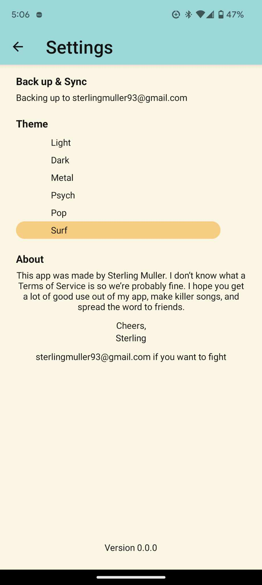
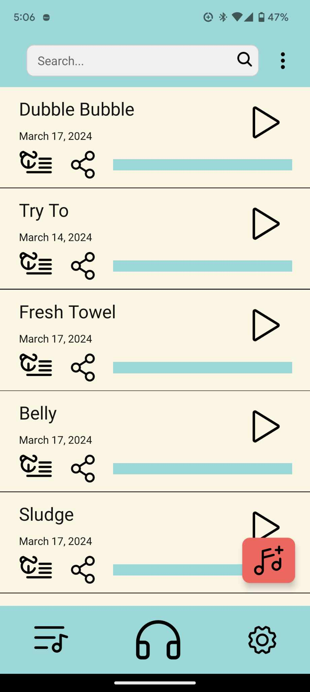

## Record, add notes, and select takes on Song Screen

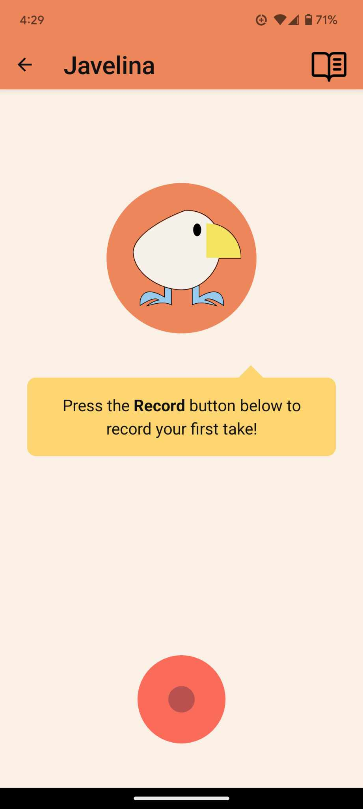
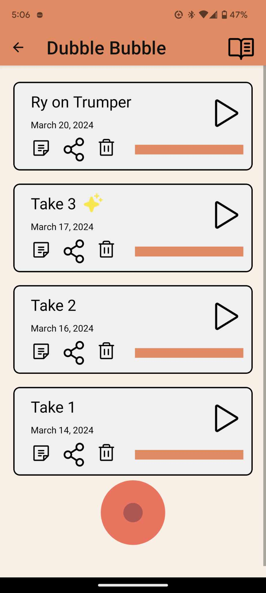
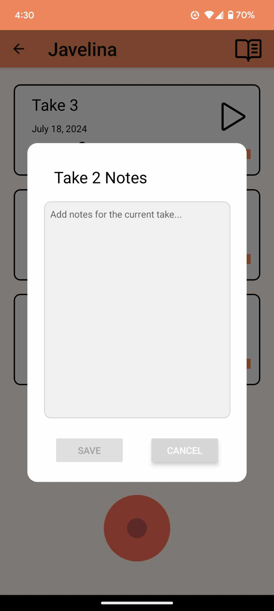

## Add lyrics and info on Lyrics Screen

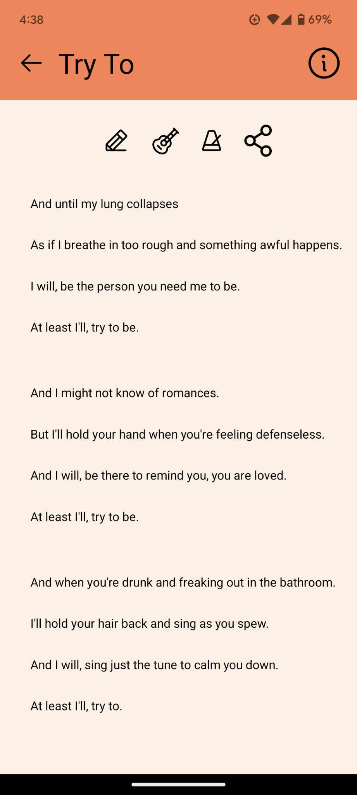
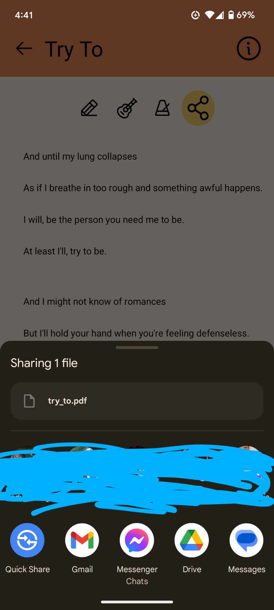
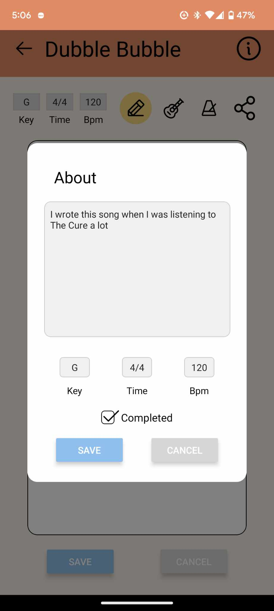

